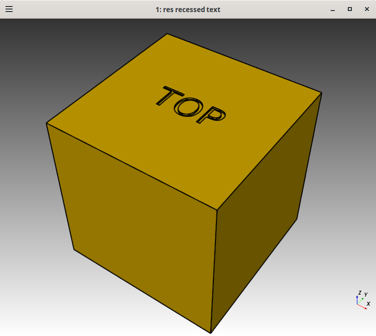

# 3D Cube with text one or more faces

CadQuery Applications that creates 3d cubes with text on the various faces.
The lorenz-fn and lorenz-wp are by lorenzncode when they answered my question on
cadquery discusion group [here](https://github.com/CadQuery/cadquery/discussions/1798).

I then created min-wp-top to better aquaint myself with the cadquery library and the
techniques used in the lorenz-fn and lorenz-wp examples.  Also explore-wp-text
explores various ways to use the cadquery workplane to create text

Before running any of the applications, ensure you have the required dependencies installed
see, [initial setup](#initial-setup). And then after initial setup be sure the
cq environment is activated using `mamba activate cq` or `conda activate cq`.

- Tested on Linux might work on Windows, and Mac.

## Activating the Environment

Activate the environment using:

```sh
mamba activate cq
```
or
```sh
conda activate cq
```

## Running the Apps

Ensure the environment is activated, see [Activating the Environment](#activating-the-environment).

There are currently 4 apps.

### explore-wp-text

explore-wp-text explores how to use the cadquery workplane to create text
recessed and protuding text on a cube face
```sh
$ ./explore-wp-text -h
usage: explore-wp-text [-h] {1,2,3,4}

Generate 3D cubes with text inscriptions.

positional arguments:
  {1,2,3,4}   Algorithm to use

options:
  -h, --help  show this help message and exit
```

```sh
./explore-wp-text 1
```


```sh
./explore-wp-text 2
```


```sh

### min-wp-top

```sh
./min-wp-top
```

### lorenz-fn and lorenz-wp

lorenz-fn and lorenz-wp both result in a cube with all faces labled.

lornenz-ft uses the "functional" style of cadquery and create lorenz-fn.stl
```sh
./lorenz-fn
```

lorenz-wp uses the "workplane" style of cadquery and create lorenz-wp.stl
```sh
./lorenz-wp
```

## Cleaning Up

Remove generated files (`.stl`, `.step`) with:

```sh
make clean
```

## Initial Setup

### 1. Install python, conda and mamba (if it or not already installed)

From: https://cadquery.readthedocs.io/en/latest/installation.html#install-the-conda-package-manager
install miniforge which includes Python 3.12+ as well as conda and mamba.

Change dir to somewhere to download the `miniforge.sh` script, user root is good enough,
and use `curl` to download `miniforge.sh` and then execute it. The -b is parameter
if for batch mode and `-p xxx` will define `xxx` as the prefix, below the
prefix will be the full path for `~/miniforge`.

Next run `mamba init`, so mamba and conda are in your PATH it modifies your .bashrc
**so you'll need to close and restart the terminal to setup your PATH:**
```
cd
curl -L -o miniforge.sh "https://github.com/conda-forge/miniforge/releases/latest/download/Miniforge3-$(uname)-$(uname -m).sh"
bash miniforge.sh -b -p $HOME/miniforge
$HOME/miniforge/bin/mamba init
```

>Note: An aggravating thing the app in `$HOME/miniforge/bin/wish`, which
is a symlink to the actual binary, can cause the font to change in change
for `gitk` and `git gui` to a thin fixed width font and looks terrible
on a 4K display. The simple fix is to delete or rename the symlink so
`wish` isn't on the PATH, `rm $HOME/miniforge/bin/wish` and also in the
environment at `rm $HOME/miniforge/envs/bin/wish`

**Close and restart the terminal to setup your PATH**

### 2. Clone this repository

```sh
git clone https://github.com/winksaville/cq-cube.git
cd cq-cube
```

### 3. Create the `cq` environment

```sh
make setup
```

You can now run
## License

Licensed under either of

- Apache License, Version 2.0 ([LICENSE-APACHE](LICENSE-APACHE) or [http://apache.org/licenses/LICENSE-2.0](http://apache.org/licenses/LICENSE-2.0))
- MIT license ([LICENSE-MIT](LICENSE-MIT) or [http://opensource.org/licenses/MIT](http://opensource.org/licenses/MIT))

### Contribution

Unless you explicitly state otherwise, any contribution intentionally submitted
for inclusion in the work by you, as defined in the Apache-2.0 license, shall
be dual licensed as above, without any additional terms or conditions.
